<p align="center">
  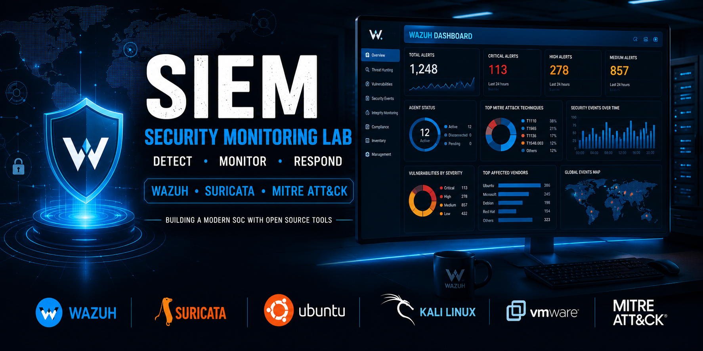
</p>

<h1 align="center">
SIEM Security Monitoring Lab
</h1>

<p align="center">
A complete Security Monitoring laboratory built with <b>Wazuh</b>, <b>Suricata</b> and the <b>MITRE ATT&CK Framework</b> for real-time threat detection, log analysis and incident response.
</p>

<p align="center">

 •  • •  •  • 

</p>

---

# Overview

This project presents the design and implementation of a complete Security Information and Event Management (SIEM) laboratory built to simulate a modern Security Operations Center (SOC).

The laboratory integrates **Wazuh**, **Suricata**, Linux virtual machines and the **MITRE ATT&CK Framework** to demonstrate how security events can be collected, correlated and analyzed in real time.

The project also includes multiple attack simulations allowing the validation of detection rules and monitoring capabilities across different cybersecurity scenarios.

# Key Features

- 🛡️ SIEM deployment using Wazuh
- 🚨 Network Intrusion Detection using Suricata IDS
- 📊 Real-time security dashboards
- 📁 File Integrity Monitoring (FIM)
- 🔐 SSH Brute Force detection
- 👤 Unauthorized Account Creation detection
- ⚡ Privilege Escalation monitoring
- 🧠 MITRE ATT&CK mapping
- 📈 Threat Hunting dashboard
- 📦 Centralized log management

# Architecture

The laboratory follows a centralized security monitoring architecture where endpoints continuously send security events to the Wazuh Manager.

Suricata analyzes network traffic while Wazuh correlates host events, IDS alerts and system logs before presenting them through interactive dashboards.

<p align="center">

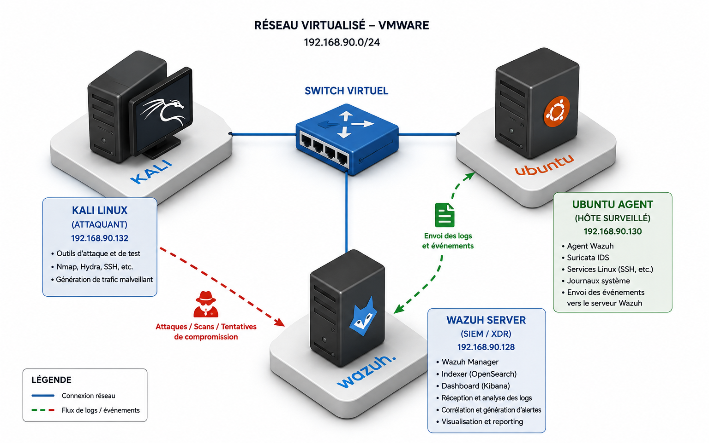

</p>

The architecture demonstrates the interaction between:

- Wazuh Manager
- Linux Agent
- Suricata IDS
- Elasticsearch
- Wazuh Dashboard
- Kali Linux Attacker

# Laboratory Environment

| Component | Technology |
|------------|------------|
| Hypervisor | VMware Workstation |
| SIEM | Wazuh |
| IDS | Suricata |
| Operating System | Ubuntu Server |
| Attacker Machine | Kali Linux |
| Agent Machine | Ubuntu Desktop |
| Log Storage | Elasticsearch |
| Dashboard | Wazuh Dashboard |

# Technology Stack

- Wazuh
- Suricata
- Ubuntu Server
- Ubuntu Desktop
- Kali Linux
- VMware Workstation
- MITRE ATT&CK Framework
- Linux Auditd
- File Integrity Monitoring

# Dashboard Gallery

The Wazuh Dashboard provides analysts with real-time visibility into the monitored infrastructure.

It centralizes alerts, vulnerability information, system events and network detections while enabling rapid investigation of suspicious activities.

---

## Main Dashboard

<p align="center">

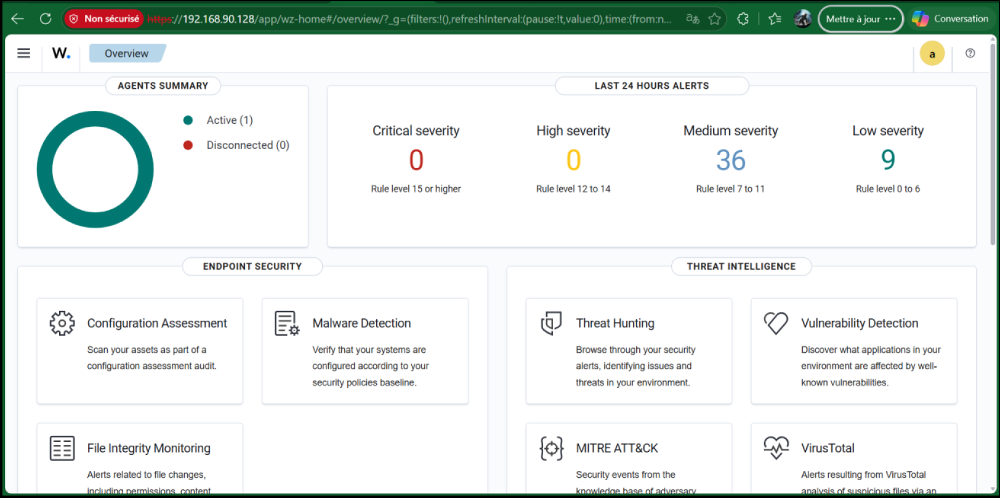

</p>

The dashboard summarizes:

- Total monitored vulnerabilities
- Critical and High severity vulnerabilities
- Average CVSS and EPSS scores
- Risk distribution
- Top affected vendors
- Interactive security visualizations

---

## Threat Hunting

<p align="center">

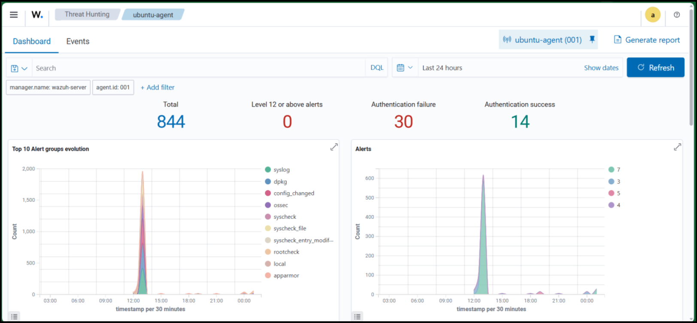

</p>

The Threat Hunting view enables analysts to investigate security events through advanced queries, timeline analysis and log exploration.

---

## Security Alerts

<p align="center">

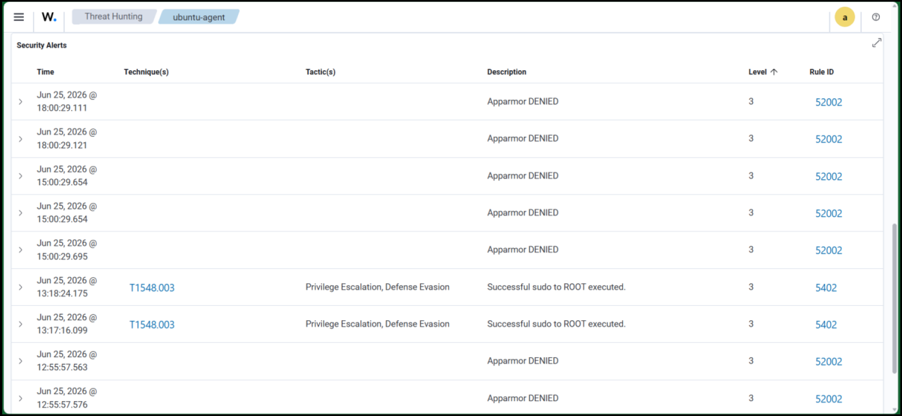

</p>

Real-time alerts generated by Wazuh allow analysts to quickly identify malicious activities and validate detection rules.

# Detection Scenarios

The laboratory validates multiple real-world attack scenarios to demonstrate the effectiveness of the monitoring platform.

Each scenario produces security events collected, correlated and visualized by Wazuh.

## Scenario 1 — File Integrity Monitoring (FIM)

The first scenario demonstrates how Wazuh detects unauthorized modifications to monitored files.

Whenever a protected file is created, modified or deleted, the File Integrity Monitoring module immediately generates security events.

<p align="center">

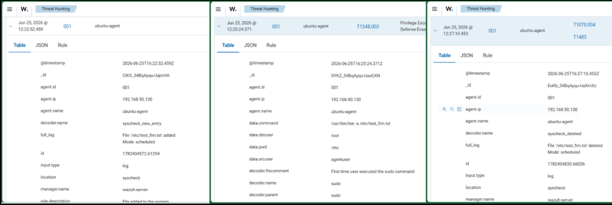

</p>

**Detection**

- File Monitoring
- Integrity Verification
- Real-time Alert Generation

**Result**

✔️ Successful detection of file modifications.

## Scenario 2 — Network Intrusion Detection (Suricata)

Suricata analyzes network traffic and generates IDS alerts whenever suspicious packets are detected.

The generated events are forwarded to Wazuh for centralized analysis.

<p align="center">

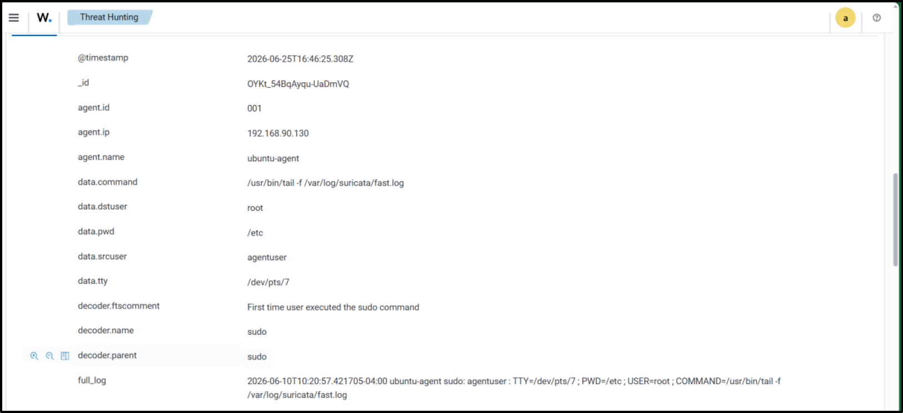

</p>

**Detection**

- Network IDS
- Signature-based Detection
- Packet Inspection

**Result**

✔️ Successful integration between Suricata and Wazuh.

## Scenario 3 — SSH Brute Force Attack

A brute-force attack was launched from Kali Linux using Hydra against an Ubuntu SSH service.

Repeated authentication failures were detected and correlated by Wazuh.

<p align="center">

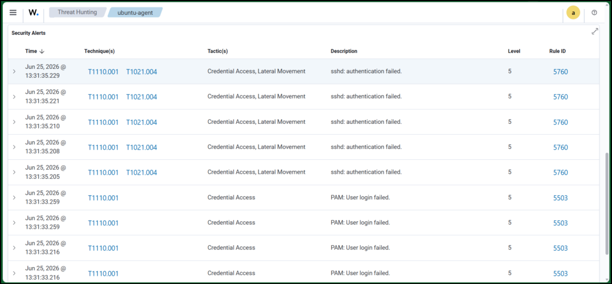

</p>

**MITRE ATT&CK**

- T1110 — Brute Force

**Detection**

- Authentication Failure
- SSH Monitoring
- Attack Correlation

**Result**

✔️ Brute-force attack successfully detected.

## Scenario 4 — Unauthorized User Creation

An unauthorized local account was created on the monitored machine.

Wazuh immediately generated alerts after detecting modifications to the system account database.

<p align="center">

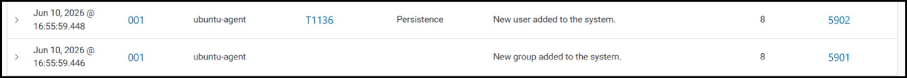

</p>

**MITRE ATT&CK**

- T1136 — Create Account

**Detection**

- User Creation
- Privilege Monitoring

**Result**

✔️ Account creation successfully detected.

## Scenario 5 — Privilege Escalation

A privileged command executed through sudo generated security events collected by Wazuh.

The laboratory demonstrates monitoring of privileged operations performed on Linux systems.

<p align="center">

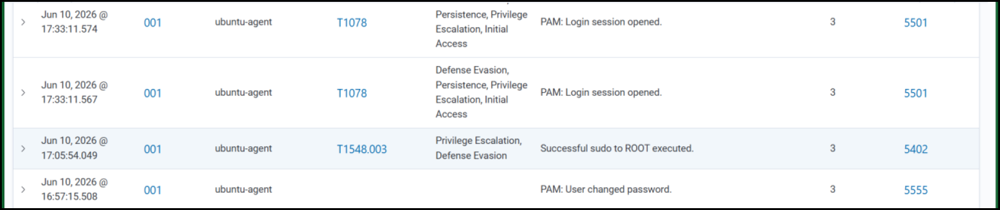

</p>

**MITRE ATT&CK**

- T1548.003 — Sudo and Sudo Caching

**Detection**

- Sudo Monitoring
- Privilege Escalation

**Result**

✔️ Privileged activity successfully detected.

# MITRE ATT&CK Mapping

| Scenario | Technique | MITRE ID |
|----------|-----------|-----------|
| SSH Brute Force | Brute Force | T1110 |
| User Creation | Create Account | T1136 |
| Privilege Escalation | Sudo | T1548.003 |
| File Integrity Monitoring | File Monitoring | T1565 |
| Network IDS | Network Monitoring | TA0011 |

# Detection Pipeline

The monitoring workflow combines automated vulnerability collection, normalization, enrichment and centralized storage.

Security information is continuously synchronized from multiple trusted sources before being correlated and visualized.

<p align="center">

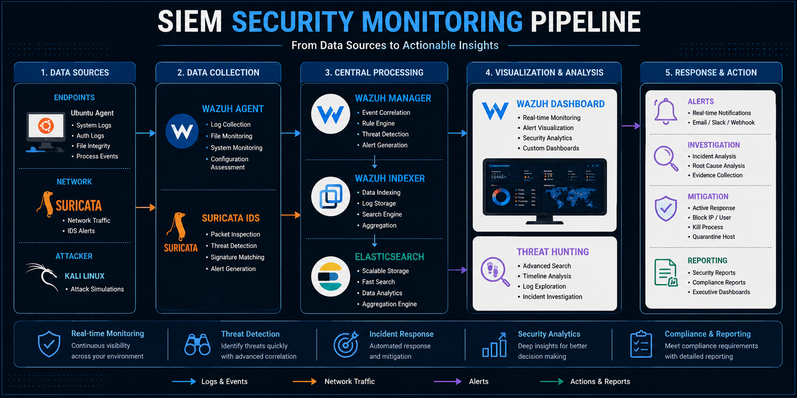

</p>

The pipeline integrates:

- National Vulnerability Database (NVD)
- CISA Known Exploited Vulnerabilities (KEV)
- EPSS Scores
- Data Normalization
- Information Enrichment
- SQLite Storage
- Automated Synchronization

# Project Structure

```text
siem-security-monitoring-lab
│
├── assets
│   ├── banner.png
│   ├── architecture.png
│   ├── dashboard.png
│   ├── threat-hunting.png
│   ├── alerts.png
│   ├── scenario-fim.png
│   ├── scenario-suricata.png
│   ├── scenario-hydra.png
│   ├── scenario-account.png
│   ├── scenario-sudo.png
│   └── mitre-mapping.png
│
├── docs
│   ├── Report.pdf
│   └── Lab-Setup.md
│
├── README.md
├── LICENSE
├── CHANGELOG.md
└── .gitignore
```

# Deployment Summary

The laboratory was deployed inside VMware Workstation using three virtual machines.

| Machine | Purpose |
|---------|----------|
| Wazuh Server | SIEM / XDR Platform |
| Ubuntu Agent | Monitored Endpoint |
| Kali Linux | Attack Simulation |

Main deployment steps:

1. Install VMware Workstation.
2. Deploy Ubuntu Server for Wazuh.
3. Install Wazuh Manager, Indexer and Dashboard.
4. Deploy Ubuntu Agent.
5. Install Wazuh Agent.
6. Install and configure Suricata.
7. Register the agent.
8. Validate communication.
9. Execute attack scenarios.
10. Analyze generated alerts.

# Laboratory Workflow

The monitoring laboratory follows the lifecycle below:

```
Attack Simulation
        │
        ▼
Linux System Logs
        │
        ▼
Suricata IDS
        │
        ▼
Wazuh Agent
        │
        ▼
Wazuh Manager
        │
        ▼
Indexer
        │
        ▼
Dashboard
        │
        ▼
Security Analyst
```

This workflow reproduces the monitoring cycle commonly found in Security Operations Centers (SOC).

# Results

Five representative cybersecurity scenarios were successfully executed and detected.

| Scenario | Status |
|----------|--------|
| File Integrity Monitoring | ✅ |
| Suricata Network Detection | ✅ |
| SSH Brute Force | ✅ |
| Unauthorized User Creation | ✅ |
| Privilege Escalation | ✅ |

The generated events were successfully centralized, correlated and visualized within the Wazuh Dashboard.

# Future Improvements

Future developments may include:

- Windows endpoints with Sysmon
- Active Response automation
- Docker deployment
- Sigma rule integration
- YARA rule integration
- Threat Intelligence feeds
- Multiple Linux and Windows agents
- Custom SOC dashboards
- Email and Slack alerting
- Automated Incident Response playbooks

# Author

Developed by

**Aaron ABAVI**

Professional Master's in Computer Science — Cybersecurity

Université du Québec à Chicoutimi (UQAC)

Supervisor:

**Mr. Fehmi Jaafar**

# License

This project is released under the MIT License.

See the LICENSE file for additional information.
